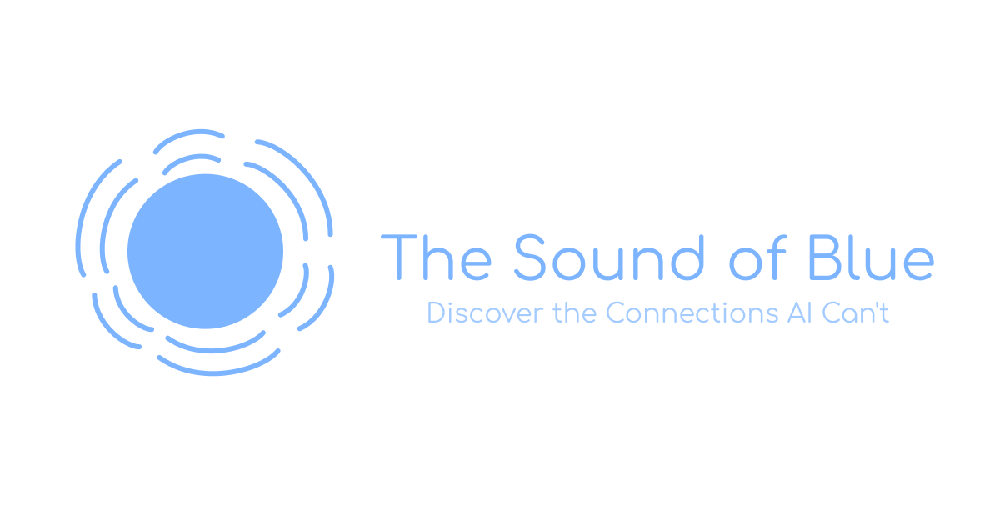

<!-- LOGO -->
 
<h1>

  
  <!--  The Sound of Blue -->
</h1>

  <a href="#about-the-project">About The Project</a> •
  <a href="#stack">Stack</a> •
  <a href="#credits">Credits</a>

## About The Project
The Sound of Blue" is a captivating exploration into the complex tapestry of human thought and creativity. This innovative platform invites users to propose two seemingly unrelated phrases, and our AI calculates a 'relevance score' representing its interpretation of their connection. Phrases with the lowest scores — those connections most elusive to AI but meaningful to us — are compiled for users to upvote or downvote, democratically surfacing connections uniquely human. It's a fascinating blend of cognitive science, AI capabilities, and community engagement, offering a novel perspective on the kaleidoscopic ways we, as humans, perceive and connect ideas.

## Why I Built It
"The Sound of Blue" was born out of a deep-seated fascination with the intricacies of human cognition and our unique capacity for abstract thought. Inspired by the challenge of unearthing connections that an AI struggles to grasp, I sought to create a space where human imagination and creativity could take center stage. It became a quest to shed light on those elusive, yet meaningful links that are often hidden from AI understanding but are beautifully apparent to us. Leveraging the precision of AI technology, coupled with the power of collective engagement, this platform serves as a testament to human ingenuity and the myriad ways we comprehend and link disparate concepts. It's more than just a game — it's an homage to our ability to weave together the vibrant tapestry of human perception, a celebration of the connections that make us inherently human.

## Stack

Name                          |  Usage
----------------------------------|------------------------------------------------------------------------------------
Vercel           |  A versatile platform for static sites and Serverless Functions that enables rapid deployment and seamless scalability
Next.js            |  A React framework offering server-side rendering and generating static webpages, used as the backbone of our app for efficient performance and optimized SEO
Supabase                |  An open-source Firebase alternative, providing us with a sql database, crucial for managing our user data and voting system.
Tailwind CSS                 |  A utility-first CSS framework that allows us to quickly build custom user interfaces without leaving our HTML, ensuring 'The Sound of Blue' is both visually appealing and user-friendly.
React Table                |  A lightweight, flexible, and extendable datagrid built with React, utilized to effectively manage and display the list of phrase pairs and their respective votes.

## Credits
- Created by Jack Burrus

## License
Distributed under the MIT License.